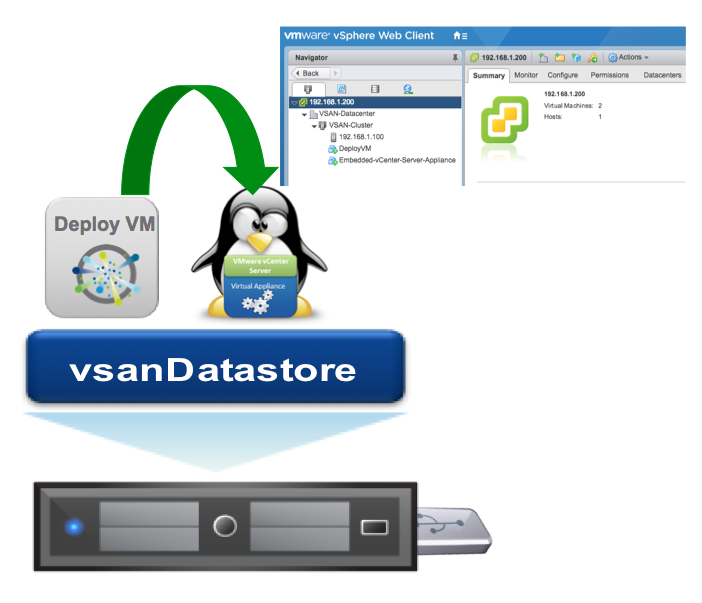

#  USB to SDDC



## Table of Contents

* [Description](#description)
* [Additional Resources](#additional-resources)
* [Environment Requirements](#environment-requirements)
* [Software Requirements](#software-requirements)
* [Usage](#usage)
* [Expected Timings](#expected-timings)
* [Troubleshooting](#troubleshooting)

## Description

Would it not be cool if you could simply plug in a USB key which had a specific configuration defined and have ESXi, vCenter Server Appliance and vSAN automatically install and configure itself without any additional user interaction?

This is what Project USB to SDDC is all about!

## Additional Resources

For more details about this solution, please take a look at the following blog posts:

* [Project USB to SDDC - Part 1](http://www.virtuallyghetto.com/2017/04/project-usb-to-sddc-part-1.html)
* [Project USB to SDDC - Part 2](http://www.virtuallyghetto.com/2017/04/project-usb-to-sddc-part-2.html)
* [Project USB to SDDC - Part 3](http://www.virtuallyghetto.com/2017/04/project-usb-to-sddc-part-3.html)


## Environment Requirements

* USB key that is at least 6GB in capacity
* Access to either macOS or Linux system as the script that creates the USB key is only supported on these two platforms
* No additional USB keys must be plugged into the hardware system other than the primary installer USB key
* Hardware system must have at least 2 disk drives which can either be **1xHDD** and **1xSSD** for running Hybrid vSAN OR **2xSSD** for running All-Flash vSAN
* Both Intel NUC 6th Gen and Supermicro E200-8D and E300-8D have been tested with this solution. It should work with other hardware systems that meet the minimum requirements but YMMV

## Software Requirements
* [ESXi 6.5a - VMware-VMvisor-Installer-201701001-4887370.x86_64.iso](https://my.vmware.com/web/vmware/details?downloadGroup=ESXI650A&productId=614&rPId=15340)
* [VCSA 6.5b - VMware-VCSA-all-6.5.0-5178943.iso](https://my.vmware.com/web/vmware/details?productId=614&rPId=15340&downloadGroup=VC650B)
* [DeployVM.zip](https://download3.vmware.com/software/vmw-tools/wlam/DeployVM.zip)
* [UNetbootin](https://unetbootin.github.io/linux_download.html) (Required for Mac OS X users)

**Note:** Other ESXi / VCSA 6.5.x versions can also be substituted

## Usage

**Step 1** - Clone the Github repository to your local system by running the following command:

```
git clone https://github.com/lamw/usb-to-sddc.git
```

If you do not have git installed on your computer or if you prefer to just download the scripts manually, you can do so by downloading the following file below:

[https://github.com/lamw/usb-to-sddc/archive/master.zip](https://github.com/lamw/usb-to-sddc/archive/master.zip)

**Step 2** - Change into the usb-to-sddc directory or extract the contents if you downloaded the zip file instead.

**Step 3** - Download all the files listed in the **Software Requirements** above to your local desktop.

**Step 4** - Open the `KS.CFG` using your favorite text editor such as vi, Visual Studio Code, etc. Search for the following tag in the file **# ---> START EDIT HERE <--- #** which should be located on [Line 10](KS.CFG#L10).

There are 25 variables as shown below which can be adjusted to customize your deployment:

```bash
VSAN_DISK_TYPE="AF"
PHOTON_IP="192.168.1.10"
PHOTON_CIDR="24"
PHOTON_GATEWAY="192.168.1.1"
PHOTON_DNS="192.168.1.1"
ESXI_IP="192.168.1.100"
ESXI_PASSWORD="VMware1!"
ESXI_NETMASK="255.255.255.0"
ESXI_GATEWAY="192.168.1.1"
ESXI_HOSTNAME="nuc.primp-industries.com"
ESXI_DNS="192.168.1.1"
VCSA_IP="192.168.1.200"
VCSA_HOSTNAME="192.168.1.200"
VCSA_PREFIX="24"
VCSA_GATEWAY="192.168.1.1"
VCSA_DNS="192.168.1.1"
VCSA_SSO_DOMAIN_NAME="vsphere.local"
VCSA_SSO_SITE_NAME="virtuallyGhetto"
VCSA_ROOT_PASSWORD="VMware1!"
VCSA_SSO_PASSWORD="VMware1!"
VCSA_SSH_ENABLED="true"
VCSA_CEIP_ENABLED="true"
VCSA_DATACENTER_NAME="VSAN-Datacenter"
VCSA_CLUSTER_NAME="VSAN-Cluster"
VCSA_WEBCLIENT_THEME_NAME="CormacHogan"
```
The variables should be pretty self-explantory, but here are few that need some additional explanation:

* **VSAN_DISK_TYPE** - Defines whether you have a Hybrid or All-Flash vSAN setup based on your physical disks. The valid values are `HYBRID` or `AF`.

* **PHOTON_IP** - This is the IP Address of the DeployVM. If you are deploying in an isolated network (e.g. using cross-over cable between your laptop and server), make sure the network between DeployVM and ESXi host is on the same network.

* **PHOTON_CIDR** - This is the CIDR network for DeployVM (e.g. 24 = /24 = 255.255.255.0).

* **PHOTON_GATEWAY** and **PHOTON_DNS** - This is the Gateway and DNS Server for DeployVM.

* **VCSA_IP** and **VCSA_HOSTNAME** - If you do not have valid DNS in your enviornment which both forward and reverse is functional, then make sure both these variables have the exact same IP Addresss or your VCSA deployment will fail as it will try to resolve the hostname (FQDN) with the DNS server you provided.

* **VCSA_WEBCLIENT_THEME_NAME** - Defines the theme that will automatically be applied if you wish to customize the vSphere Web Client as described [here](https://github.com/lamw/customize-vsphere-web-client-6.). You can find the complete list of theme names [here](https://github.com/lamw/customize-vsphere-web-client-6.5/tree/master/theme).

**Step 5** - Next, edit either **create_sddc_deployment_on_usb_for_osx.sh** or **create_sddc_deployment_on_usb_for_linux.sh** depending on the platform that you will be using to create the USB installer. You will need to edit the following variables at the top of the script which will point it to the download files you had performed in Step 3.

* **UNETBOOTIN_APP_PATH** - Complete path to the UNetbootin application directory, only applicable for Mac OS X users
* **ESXI_ISO_PATH** - Complete path to the ESXi ISO
* **VCSA_ISO_PATH** - Complete path to the VCSA ISO
* **ESXI_KICKSTART_PATH** - Complete path to the KS.CFG
* **DEPLOYVM_ZIP_PATH** - Complete path to the DeployVM zip

**Step 6** - The next step is to now use **the create_sddc_deployment_on_usb_for_X.sh** to create our USB insaller. Plug a USB key into your system. Please be aware, all contents on the USB key will be wiped *after* you confirm the USB key that is to be used to create the automated installer.

First you need to identify the USB device that was plugged in to your system to make sure you select the right one.
* On macOS - You can run ```diskutil list``` and identify the device which should look like `/dev/diskX`.
* On Linux - You can run ```parted -l``` and identify the device which should look like `/dev/sdX`.

Next, to run the script you will need to use **sudo** and pass in the device that you had retrieved from the previous commands.

Here is an example of running on macOS system:

```
sudo ./create_sddc_deployment_on_usb_for_osx.sh /dev/disk4
```

The script will automatically clear existing partitions and create the expected partition scheme. It will copy all the software packages you had downloaded from Step 3 and once it has completed, it will also unmount the USB device.

**Step 7** - The final step is to now take the USB key and plug it into your system and simply power it on. If you want to verify that things are working, you can connect an external monitor and watch the installation but I will warn you, it is pretty boring :) If things are going well, you should see the ESXi installer stay on the *"reading installation file"* for quite a while as this is where the majority of the time is spent during the `%pre` section where it forms the vSAN datastore and copies all the files from PAYLOAD partition over to vSAN.

Once ESXi has been successfully installed, which you can verify by observing it is on the main boot screen with an IP Address. You can open a browser to ESXi Embedded Host Client (e.g https://[IP]/ui) and login. Depending on when this is done, you may only see the DeployVM and/or VCSA being deployed. If you want to follow the remainder progress of the deployment, you can login to the DeployVM using the IP Address you had assigned it and the credentials is `root/VMware1!` by default.

Once logged into the DeployVM, you can tail `/root/script.log` which will give you the progress of the VCSA deployment and configuration.

## Expected Timings

Here is what you can expect from a timing standpoint from creating the USB Installer to plugging it into your system and provisioning the SDDC. From the testing I have observed in my personal lab, the USB Installer took 11min and the USB to SDDC deployment took 45min, which is from the time I plugged it into the NUC and powered it on to point where I can login to the vSphere Web Client of the vCenter Server. Obviously, YMMV depending on your hardware configuration.

| Process                  | Estimated Time |
|--------------------------|----------------|
| Create USB Installer key | 10-15min       |
| USB to SDDC deployment   | 45-60min       |

## Troubleshooting

* If the ESXi installation failed or halted - You will need console access to your system and see what error is seen on the screen. You may also need to go into the ESXi Shell to see if vSAN datastore was properly configured. You can login using root and no password.

* If the VCSA deployment failed or halted - You can login to the DeployVM via SSH using the IP Address that you had assigned it and the credentials is `root/VMware1!` by default. Have a look at /root/script.log to see where it last left off or any error messages that have been logged.
